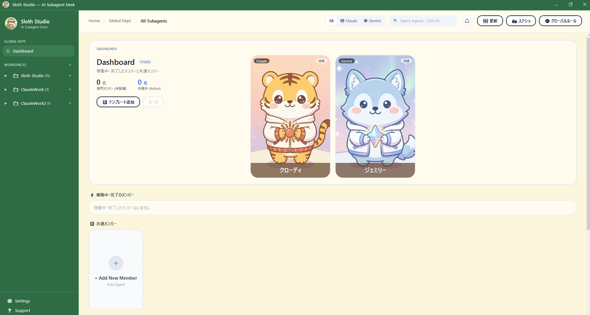
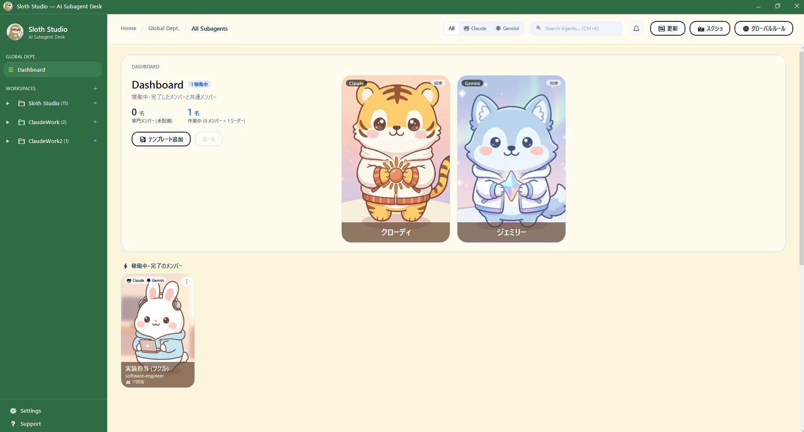

# Sloth Studio — AIサブエージェントの司令塔（ベータ 0.9.0）

Claude Code と Gemini（Antigravity）のサブエージェントを、チーム単位で管理できる Windows デスクトップアプリです。
「いま誰が動いているか」「誰が終わったか」を、カードでひと目で見える化します。




---

## できること

- **チーム・メンバー管理**: ワークスペース（作業フォルダ）の中にチームを作り、メンバー（サブエージェント）をカードで一覧表示します。カードの右クリック、または右上の「⋮」から、詳細の確認・編集・複製・削除ができます。
- **リーダーカード**: クローディ（Claude）とジェミリー（Gemini）が、各AIのリーダーとして表示されます。
- **作業中・完了の見える化**: 作業中のメンバーのアバターはゆらゆら揺れます。完了するとカードが光り、アバターが「ぷるん」と動きます。アプリが前面にないときは、タスクバーのアイコンが点滅します。完了音も鳴らせます（既定はオフ。設定画面でオンにします）。これらは設定画面で個別にオン・オフできます。
- **Dashboard**: 稼働中のメンバーと、完了したメンバーが並びます。完了カードは、クリックして確認すると消えます。
- **職種別テンプレートから追加**: 職種別のテンプレートからメンバーを選び、配置先（Claude 専用 / Gemini 専用 / 両方）を決めて追加できます。モデルは4段階（継承 / 超軽量・最速 / 高速・低コスト / 最高知能）から選べます。
- **ルール管理**: ワークスペース・チーム・グローバルの各ルール（`CLAUDE.md` / `GEMINI.md`）を、画面から確認・編集できます。
- **アバター**: 画像をドラッグ＆ドロップして設定できます。あらかじめ同梱のアバターもあります。
- **呼びかけ文のコピー**: カードを右クリック →「📣 呼びかけ文をコピー」で、そのメンバーに仕事を頼むための文をクリップボードにコピーできます（コピーするだけで、AIやコマンドは起動しません）。

---

## 動作環境

- Windows 10 / 11（64bit）
- 配布zip（自己完結型）を使う場合、.NET の事前インストールは不要です。
- ソースからビルドする場合は .NET 10 SDK が必要です。
- Claude Code（`claude` コマンド）または Gemini（Antigravity。`agy` コマンド）がある環境で、メンバーの動きの検知が働きます。なくても、管理画面は使えます。

---

## クイックスタート

1. 配布zipをダウンロードします。
2. 好きな場所に解凍します。
3. `AgentDeskApp.exe` を起動します。

### Windows の警告（SmartScreen）が出たとき

このアプリは署名されていないため、初回起動時に「WindowsによってPCが保護されました」と出ることがあります。次の手順で起動できます。

1. 警告画面の **「詳細情報」** をクリックします。
2. 表示された **「実行」** ボタンをクリックします。

### 初回起動の流れ

1. 最初は「Sloth Studio へようこそ！」の画面が出ます。**「📁 最初のワークスペースを追加する」** を押して、作業フォルダ（プロジェクト）を選びます。左下の「＋」ボタンからも追加できます。
2. メンバーがまだいない場合は「まだサブエージェントが登録されていません」と案内が出ます。**「📑 職種別テンプレートから追加...」** で一括登録するか、**「＋ 手動でメンバー追加」** で1人ずつ登録します。
3. Claude Code や Gemini でサブエージェントを動かすと、該当メンバーのカードが作業中になります。

---

## メンバーの動きを見える化する仕組みと、書き方のコツ

アプリは、Claude Code と Gemini（Antigravity）の会話ログを読んで、「どのメンバーが呼ばれたか」を判断しています。

### Claude Code の場合

- **作業フォルダ直下の `.claude/agents` にいるメンバー**は、Claude Code が名前（`subagent_type`）で呼ぶので、そのまま検知されます。
- **親フォルダ（ワークスペースのルート）から、子フォルダのチームのメンバーを呼ぶとき**は、Claude Code が名前でそのメンバーを呼べません。汎用のサブエージェントへの指示の**先頭**に、次のように書いてください。アプリがメンバーを判別して、作業中にします。

```
担当: ツクル（実装担当）
```

検知される書き方の例:

| 書き方 | 例 |
| --- | --- |
| 「担当: ○○」 | `担当: ツクル` |
| 「○○として」 | `ツクルとして、次の作業をしてください` |
| 「@○○」 | `@ツクル` |
| 「○○に頼んで」 | `ツクルに頼んで、〜をしてください` |

検知されない書き方の例:

- 名前だけを書く（例: `ツクル`）
- 名詞だけの文（例: `ツクルの実装`）
- 名前の列挙（例: `ツクル、シラベ、イジワル`）

迷ったら、カードを右クリック →「📣 呼びかけ文をコピー」を使うと、メンバーの正式名と表示名が入った依頼文をコピーできます。

> Claude のデスクトップ版は、サブエージェントを非同期で起動します。アプリは、完了時に届く通知（task-notification）を見て完了を検知します。

### Gemini（Antigravity）の場合

- `invoke_subagent` の **Role** に、メンバーの表示名と同じ文言を書いてください（例: `ビジュアル担当 (エガク)`）。かっこの中の呼び名（例: `エガク`）だけでも照合できます。
- 照合は完全一致で行います。説明文に名前が含まれているだけでは、検知されません。

---

## 設定と、読み書きするファイル（プライバシー）

### 通信について

アプリ自体は、ネットワークに通信しません。会話内容を外部へ送ることもありません。

### 読むもの

- `%USERPROFILE%\.claude\projects` 内の会話ログ（Claude Code）
- `%USERPROFILE%\.gemini\antigravity\brain` 内の会話ログ（Gemini / Antigravity）

会話ログは、主に作業状態の検知に使います。ただし、「タスク履歴」画面は、これらの会話ログからプロンプトと応答の本文を読み、画面に表示します。表示するだけで、外部へ送ることはありません。

### 読み書きするもの

- 各フォルダの `.claude/agents`（Claude のメンバー定義）
- 各フォルダの `.agents/skills`（Gemini のメンバー定義）
- 各フォルダの `CLAUDE.md` / `GEMINI.md`
- グローバルルール: `~/.claude/CLAUDE.md`、`~/.gemini/GEMINI.md`
  - ワークスペースを追加・解除するたびに、両ファイル（ファイルが存在するときのみ）の `## グループ` 節を、登録中のワークスペースの絶対パス一覧で書き換えます。見出しが `## グループ` とちょうど一致する節（前後の空白は除く）があれば、その節の箇条書きだけが置き換えられます。`## グループ会社の方針` のように見出しが少しでも違う節は書き換えません。一致する節が無いときは、末尾に `## グループ` 節を追加します。書き換えた結果は、改行コードが Windows 標準（CRLF）に統一されます。
- アプリの設定: `%APPDATA%\AgentDeskApp\settings.json`
- ルール画面で保存するときに作るバックアップ: 対象ファイルと同じフォルダの `<ファイル名>.bak_日時`
- エージェントの画像: メンバーの追加・編集時に、同梱のアバター画像や選んだ画像を、メンバーの配置先（`.claude/agents`、`.agents/skills/<ID>`）へコピーします（`<ID>.jpg` や `avatar.jpg` など）。
- チーム作成時: 親ワークスペースの `memory/AI_MEMORY.md`（無ければひな形を作成）と、チームの `CLAUDE.md` / `GEMINI.md`（無いときだけ、ひな形を作成）
- 診断ログを有効にしたときだけ: `%APPDATA%\AgentDeskApp\logs`

### 実行する外部コマンド

- **自動（定期実行）**: `claude agents --json`（作業中セッションの確認。既定は30秒ごと。5秒で応答がなければ打ち切ります）
- **起動時・設定画面・更新ボタン**: `claude --version` と `agy --version`（CLIがあるかの確認）。`.cmd` 形式のCLIのときは `cmd.exe /c` を経由します。
- **操作したときだけ**: エクスプローラー（フォルダを開く）、画面の切り取り（スクリーンショット添付）、既定のブラウザ（ヘルプ内のリンクを開いたとき）
- 上記以外のコマンドは実行しません。
- 実行される `claude` や `agy` は、各ツールの仕様で通信する場合があります。

### 診断ログ（既定はオフ）

不具合を調べるときだけ、`%APPDATA%\AgentDeskApp\settings.json` に次を追加して有効にします。

```json
"DiagnosticLogEnabled": true
```

出力先は `%APPDATA%\AgentDeskApp\logs\agentdesk-diagnostic.log` です。記録するのは、メンバー名・状態・件数・短縮したセッションIDだけで、会話内容は含みません。無効に戻すときは `false` にするか、項目を削除します。

> `settings.json` を手で編集するときは、書き方の誤り（末尾のカンマなど）にご注意ください。ファイルが壊れていると、アプリは既定値で起動し、次にワークスペースの追加や設定の保存を行ったときに、既定値のまま上書きされます。編集前にバックアップを取っておくことをおすすめします。

---

## 既知の制限

ベータ版のため、次の制限があります。

- **同じIDのメンバーを複数のチームに置くと、作業状態が共有されます。** 片方が動くと、両方のカードが動きます。
- **Gemini 側の検知は会話単位です。** そのため、前に呼ばれたメンバーも、作業中に見えることがあります。
- **揺れの表示は最短で約3秒です。** 作業中の検知はログの更新を数秒おきに読んでいるため、数秒より短い作業でも完了は検知しますが、揺れが表示される時間は最短約3秒になります。
- 不具合を見つけたら、[GitHub の Issues](https://github.com/SlothStudioAI/AgentDeskApp/issues) で教えてください（ベータ版です）。

---

## ソースからビルドする

Windows 専用です。.NET 10 SDK が必要です。

```powershell
git clone <このリポジトリ>
cd AgentDeskApp
dotnet build src/AgentDeskApp/AgentDeskApp.csproj
dotnet test src/AgentDeskApp.Tests
```

### 配布zipを作る

```powershell
./scripts/build_release_zip.ps1 -Version "0.9.0"
```

自己完結型（win-x64・シングルファイル）で `dotnet publish` し、`release/AgentDeskApp-v<バージョン>-win-x64.zip` を作ります。`-Version` を省略すると `0.9.0` になります。別のバージョンにしたいときは指定してください。

---

## 画像について

同梱のアバターとアプリアイコンは、AI（Gemini）で生成した画像です。キャラクターは独自の創作で、第三者の権利との関係はありません。画像も含めて、リポジトリ全体が MIT ライセンスです。

## 商標・免責

- Claude / Claude Code は Anthropic の商標です。Gemini / Antigravity は Google の商標です。
- 本アプリは各社とは無関係の、非公式のツールです。
- 本ソフトウェアは「AS IS（現状のまま）」で提供されます。
- 本アプリは、メンバー定義（`.claude/agents`、`.agents/skills`）やルールファイル（`CLAUDE.md`、`GEMINI.md`、`~/.claude/CLAUDE.md`、`~/.gemini/GEMINI.md`）を書き換えます。重要なファイルは、バックアップ（コピーや Git での管理）を取ってから使ってください。

## ライセンス

MIT ライセンスです。詳しくは [LICENSE](LICENSE) を参照してください。サードパーティのソフトウェアについては [THIRD-PARTY-NOTICES.md](THIRD-PARTY-NOTICES.md) を参照してください。

---

## English summary

- **What it is**: A Windows desktop app that manages Claude Code and Gemini (Antigravity) subagents as teams, and shows with cards who is working and who has finished.
- **Requirements**: Windows 10/11 (64-bit). The release zip is self-contained (no .NET install needed); building from source requires the .NET 10 SDK. Detection works when `claude` or `agy` is installed.
- **Quick start**: Download the zip, extract it, and run `AgentDeskApp.exe`. If SmartScreen appears, click "More info" then "Run anyway".
- **Known limitations**: Members with the same ID in multiple teams share their working state; Gemini detection is per conversation; the sway animation is shown for about 3 seconds at minimum. This is a beta, so please report issues on [GitHub Issues](https://github.com/SlothStudioAI/AgentDeskApp/issues). The app itself makes no network connections. The task history screen displays prompts and replies read from local conversation logs (never sent anywhere), and adding or removing a workspace rewrites the section whose heading is exactly `## グループ` (workspace paths, saved with CRLF line endings; sections with any other heading, such as `## グループ会社の方針`, are left untouched, and a new section is appended if none matches) in your global `~/.claude/CLAUDE.md` and `~/.gemini/GEMINI.md` if they exist, so back up important files first.
- **License**: MIT. Unofficial tool, not affiliated with Anthropic or Google ("AS IS"). The app edits agent definitions (`.claude/agents`, `.agents/skills`) and rule files (`CLAUDE.md`, `GEMINI.md`, including `~/.claude/CLAUDE.md` and `~/.gemini/GEMINI.md`), so please back up anything important first.
